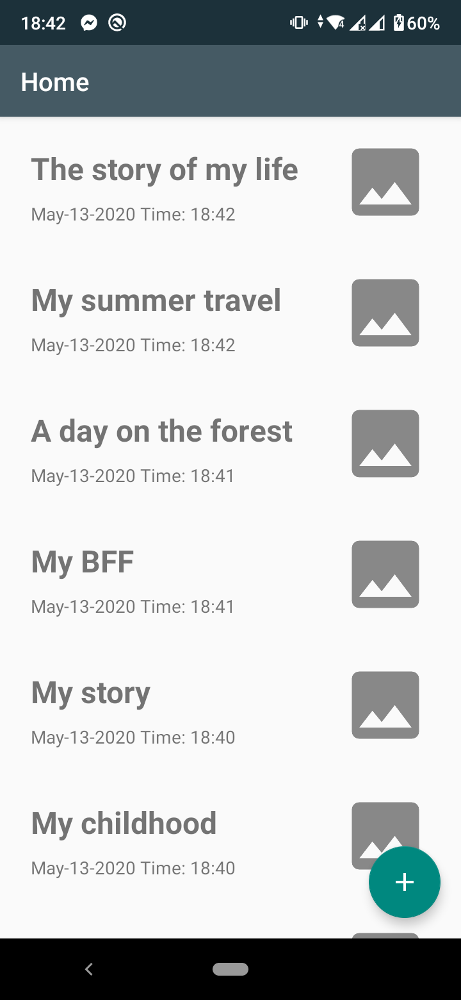
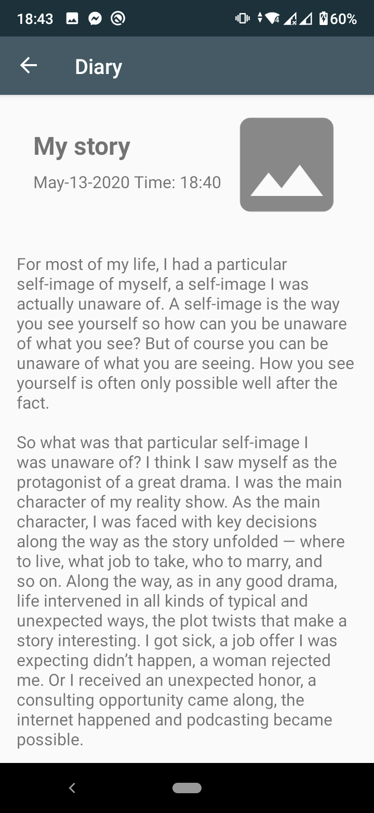
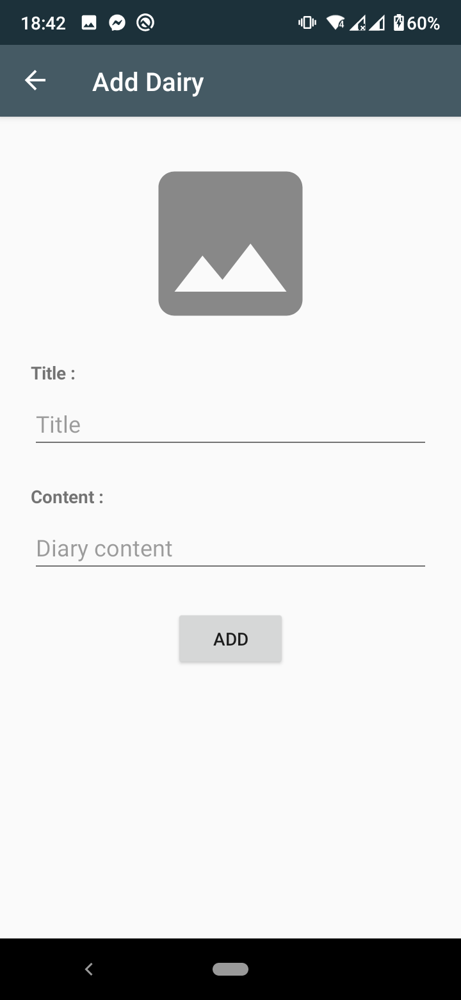

# MyDiary
A simple Android App (Demo): to save your personal diaries, built using the Jetpack components (ViewModel, LiveData, Navigation, Room components) and the new Kotlin Coroutins to handle the background jobs  

## Demo

  
  
  

